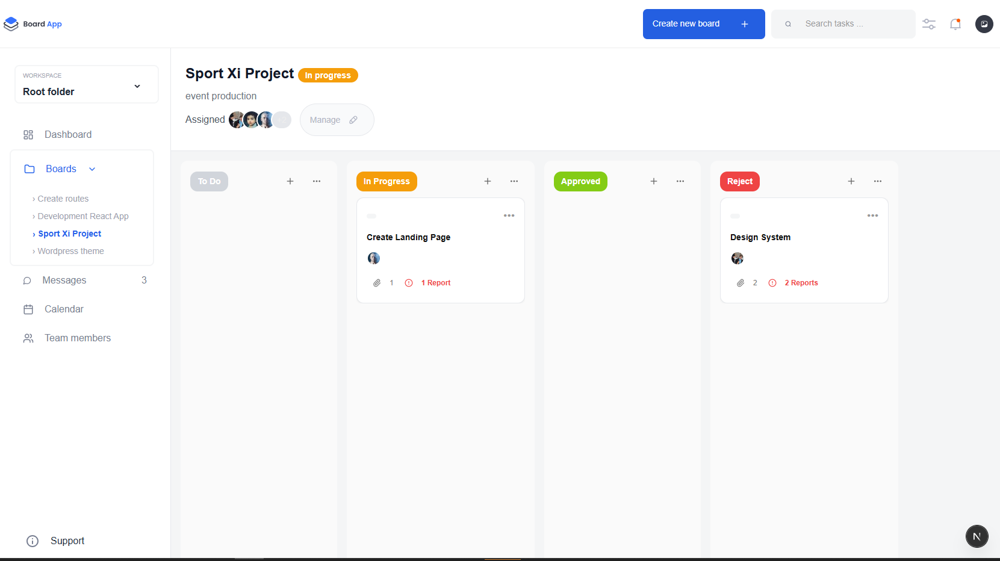
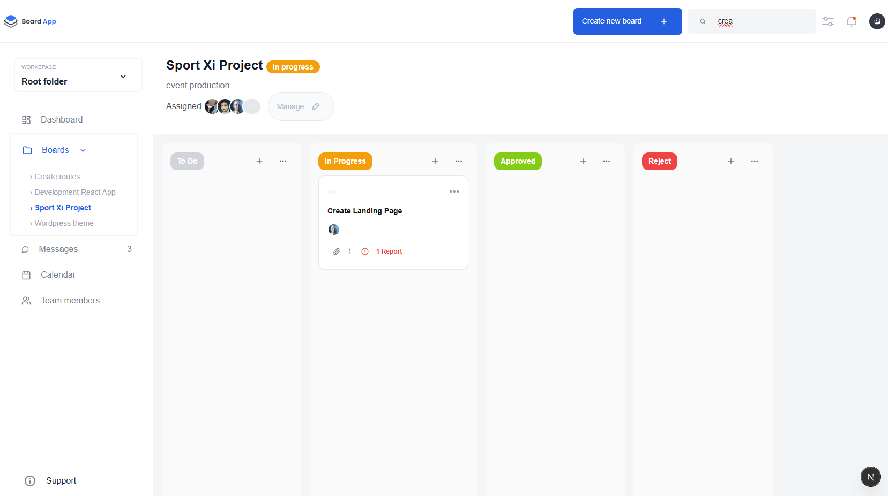

# 🏊‍♂️ Swimlane Task Board – Next.js + Zustand + TailwindCSS



A pixel-perfect, responsive Swimlane-style task dashboard built with **Next.js**, styled using **TailwindCSS**, with **drag-and-drop**, **state management** using **Zustand**, **search filtering**, and **localStorage** persistence.

---

## 🚀 Features

### ✅ UI Implementation
- Responsive layout (optimized for ≥768px).
- Pixel-perfect recreation of the provided **Figma mockup**.
- Cross-browser compatibility (modern browsers).
- Styled entirely using **TailwindCSS** utility classes.

### ✅ Swimlane Dashboard
- Tasks are grouped into **columns (swimlanes)** based on their status:  
  `To Do`, `In Progress`, `Approved`, and `Reject`.

### ✅ Drag-and-Drop
- Drag tasks between swimlanes using **@dnd-kit/core**.
- Visual feedback during drag (overlay) using `DragOverlay`.

### ✅ State Management with Zustand
- Centralized state managed via `Zustand`.
- Tasks automatically update their status on drop.
- Easy state access across components.

### ✅ Persistent Data (localStorage)
- Tasks are initially loaded from `/data/tasks.json` (mock API).
- Updates are saved to `localStorage` automatically to persist across reloads.

### ✅ Search Functionality
- Real-time task filtering as the user types in the search bar.
- Partial and case-insensitive matches supported (task title).

---

## 🛠️ Getting Started

### 1. Clone the Repository

```bash
git clone https://github.com/Nuraj250/nextjs-swimlane-dashboard.git
cd swimlane-dashboard
````

### 2. Install Dependencies

Make sure you have **Node.js ≥ 16** and **npm** installed.

```bash
npm install
```

### 3. Run the Development Server

```bash
npm run dev
```

This starts the app on:
📍 `http://localhost:3000`

---

## 🗂️ Project Structure

```
/components
  ├── BoardColumn.js      # Swimlane column UI
  ├── TaskCard.js         # Individual draggable task cards
  ├── TaskModal.js        # Modal popup for task view
  ├── Header.js           # Project header with search
  └── Sidebar.js          # Left navigation (static)

pages/
  └── index.js            # Main dashboard layout

public/
  └── data/tasks.json     # Mock task data

store/
  └── TaskStore.js        # Zustand store for state management

styles/
  └── globals.css         # Tailwind base styles
```

---

## 💾 Data Handling

* On first load, task data is fetched from `/data/tasks.json`.
* After any drag/drop or state change, tasks are updated in localStorage.
* On reload, tasks are loaded from localStorage to persist user progress.

---

## 🔍 Search

* Search bar is located in the **project header**.
* As the user types, tasks in all swimlanes are filtered in real-time.
* Case-insensitive and partial matches supported.

---

## 📦 Tech Stack

* **Next.js** (React framework)
* **TailwindCSS** (utility-first CSS)
* **@dnd-kit/core** (drag-and-drop)
* **Zustand** (global state)
* **localStorage** (browser persistence)
* **JSON mock data** (initial task load)

---

## 📸 Screenshots



---

## ✅ Submission Guidelines

> As per the assignment instructions:

* Please submit this project as a public **GitHub** or **Bitbucket** repo.
* **You must commit your changes incrementally** with meaningful messages, not all at once.
* Include this README in your root directory.

---

## 👨‍💻 Author

* **Nuraj Shaminda**
* GitHub: [@Nuraj250](https://github.com/Nuraj250)

---

## 📄 License

This project is for testing/demo purposes. All assets and designs belong to their respective owners.

